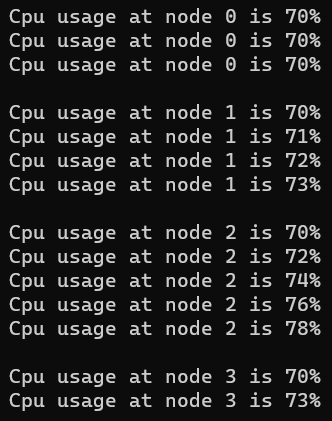

# <p align="center">Ex05-Rec-JaggedArray</p>
## Aim:
To write a C# program to create a sample CPU usage on a network with 4 nodes using a jagged array.
## Algorithm:
### Step 1:
Create a new Class named cpu.
### Step 2:
Create a jagged array of 4 arrays.

int[][] array = new int[][];
### Step 3:
Create as many sub-nodes as you wish inside one node of jagged array.
### Step 4:
Give the sample CPU usage in the jagged array.
### Step 5:
Print the sample CPU usage in the jagged array.
### Step 6:
End the Program.

## Program:
```
Developed By: Saravana Kumar S
Register No: 212221230088
```
```c#
using System;
namespace jagg
{
    class program
    {
        static void Main(string[] args) {
            int[][]cpu = new int[4][];
            {
                cpu[0] = new int[3];
                cpu[1] = new int[4];
                cpu[2] = new int[5];
                cpu[3] = new int[2];
                for (int i = 0; i < 4; i++)
                {
                    for (int j = 0; j < cpu[i].Length; j++)
                    {
                        cpu[i][j] = i*j+70;
                    }
                }
                for(int i = 0; i < 4; i++)
                {
                    for (int j = 0; j < cpu[i].Length; j++)
                    {
                        Console.WriteLine("Cpu usage at node "+i+" is "+cpu[i][j]+"%");
                    }
                    Console.WriteLine();
                }
            }
                }
    }
}
```

## Output:


## Result:
Thus, C# program to create a sample CPU usage on a network with 4 nodes using a jagged array is executed successfully.